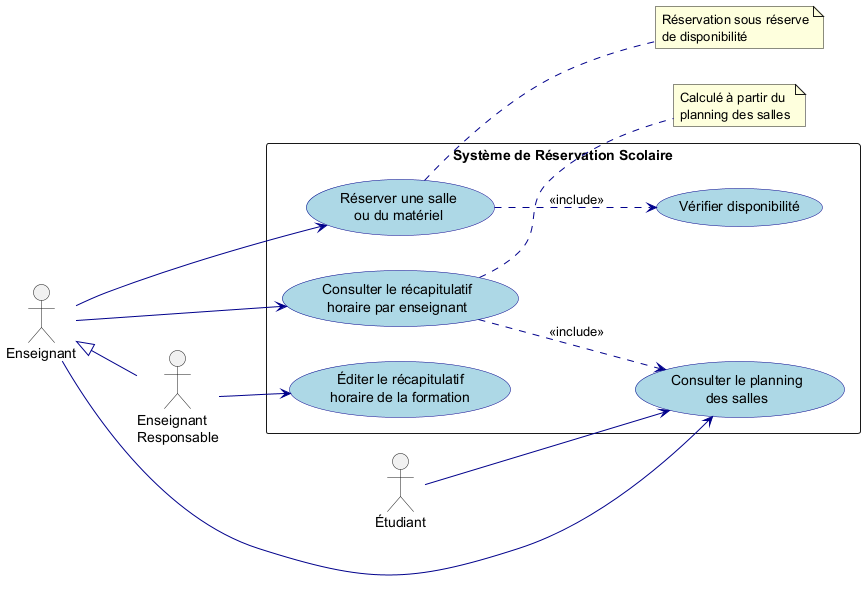
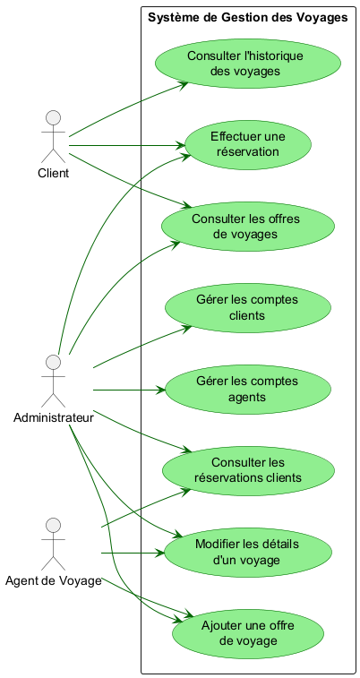
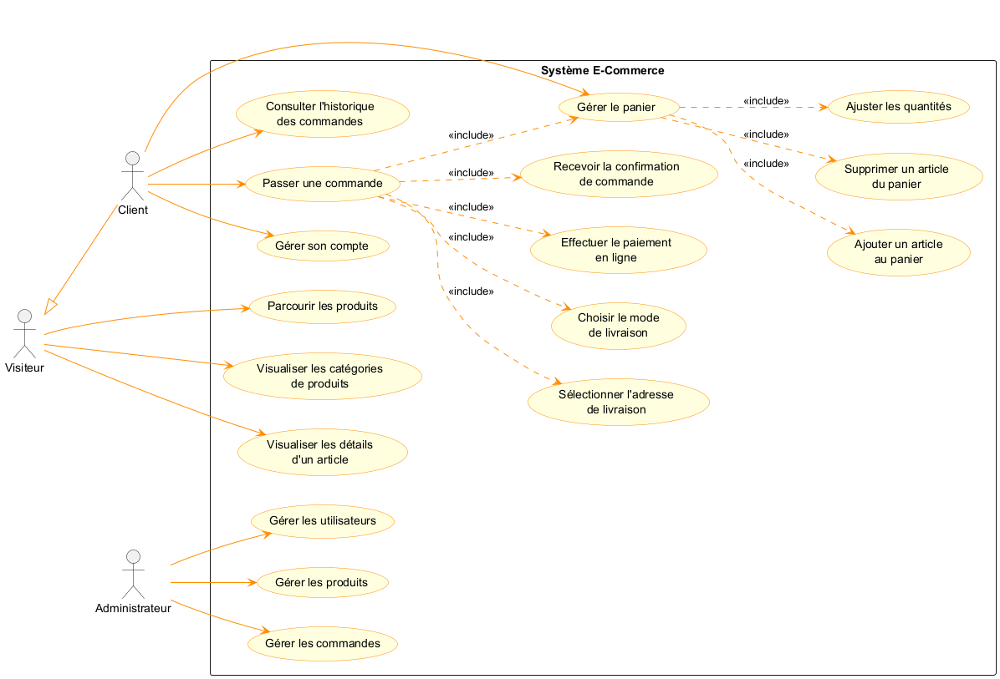

# Exercices — Diagrammes de Cas d'Utilisation (UML)

Série de trois exercices UML réalisés dans le cadre du cours **Java Avancé** à l'ENSET.  
Chaque exercice modélise un système logiciel sous forme de diagramme de cas d'utilisation.

---

## Exercice 1 — Établissement Scolaire

Modélisation d'un système de réservation de salles et de matériel pédagogique.

**Acteurs :** Étudiant, Enseignant, Enseignant Responsable

---

## Exercice 2 — Agence de Voyage

Modélisation d'un système de gestion des offres et réservations de voyages.

**Acteurs :** Client, Agent de Voyage, Administrateur

---

## Exercice 3 — Site E-Commerce

Modélisation d'un système de vente en ligne avec gestion du panier et des commandes.

**Acteurs :** Visiteur, Client, Administrateur

